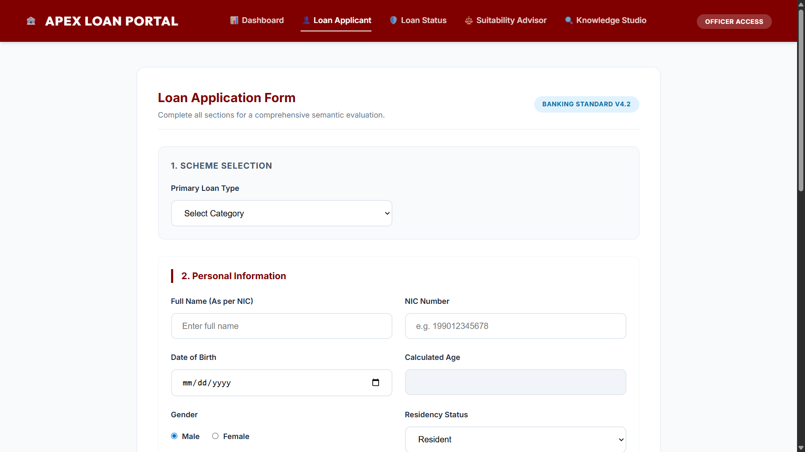
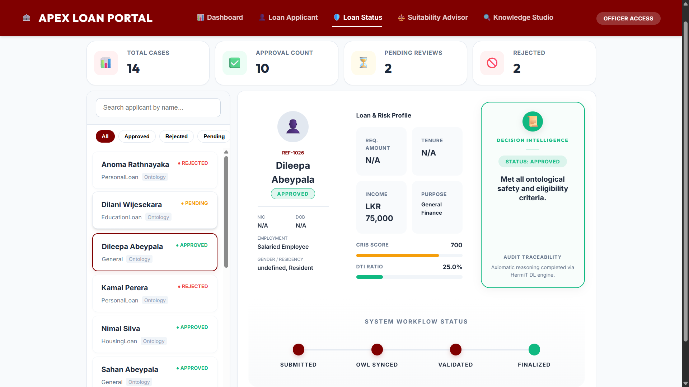
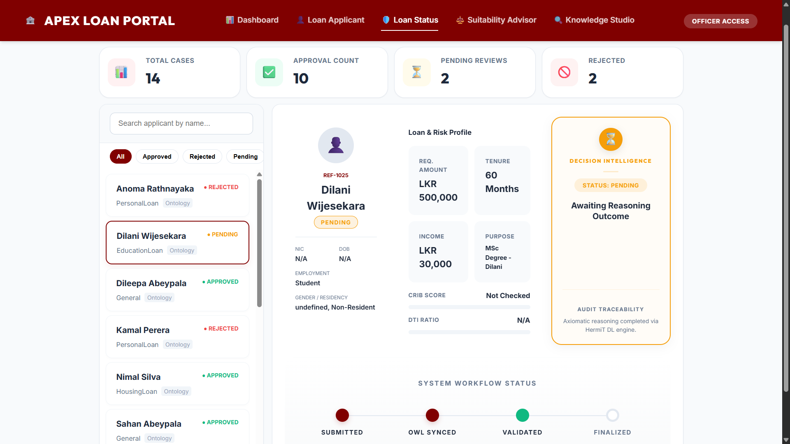

# Loan Management Ontology System

## 1. Project Overview

The Loan Management Ontology System is a semantic-web-based application designed to automate and standardize the loan approval process. By utilizing an OWL 2 ontology, the system centralizes business logic, enabling automated reasoning for applicant eligibility, risk assessment, and policy compliance.

## 2. Objective

Traditional banking systems often face challenges such as inconsistent eligibility interpretations and manual verification bottlenecks. This project addresses these issues by:

- Formalizing loan approval rules within an ontology.
- Providing automated reasoning to evaluate applicants against financial and geographic constraints.
- Offering a real-time web interface for application submission and status monitoring.

## 3. Technology Stack

- **Ontology Modeling**: Protégé / OWL 2
- **Triple Store**: Apache Jena Fuseki
- **Backend**: Python (Flask)
- **Frontend**: HTML5, Vanilla CSS, JavaScript
- **Query Language**: SPARQL 1.1

## 4. System Walkthrough

### 1. Dashboard Overview

The **Dashboard** provides a high-level summary of the system's current state. It monitors the "Knowledge Base Health" (e.g., counting active OWL classes), tracks the total number of applications, and visualizes the distribution of loan types (Housing, Personal, Education).


### 2. Loan Suitability Advisor

Before a formal application, the **Suitability Advisor** helps users identify the most appropriate loan scheme. By inputting demographic and basic financial data, the system provides a recommendation score and justifies the selection based on ontological criteria.


### 3. Loan Application Engine

The **Application Form** is a smart, context-aware interface. It captures detailed personal, professional, and financial profiles. The form dynamically adapts its requirements; for instance, selecting a "Housing Loan" reveals fields for property valuation and title status, while "Education Loans" trigger checks for academic qualifications.




### 4. Enterprise Case Manager (Real-time Status)

All submitted applications are managed in the **Case Manager**. This screen provides deep "Decision Intelligence" for each applicant:

- **Automated Diagnosis**: Applicants are instantly categorized as Approved, Rejected, or Pending based on DL reasoning.
- **Financial Dossier**: Visual comparison of CRIB scores and DTI ratios against mandated bank policies.
- **Audit Trail**: A lifecycle stepper tracks the application status from submission to final semantic validation.

#### Examples of Reasoning Outcomes:

|                 Approved Applicant                  |                 Rejected Applicant                  |                  Pending Review                   |
| :-------------------------------------------------: | :-------------------------------------------------: | :-----------------------------------------------: |
|  |  |  |

### 5. Knowledge Studio (Semantic Audit)

The **Knowledge Studio** is a powerful SPARQL terminal for administrators. It allows for direct querying of the triple store to perform complex audits, detect high-risk patterns, or extract specific datasets for reporting.


## 5. How It Works (Semantic Layer)

1. **Data Ingestion**: Application data is mapped to RDF triples.
2. **Knowledge Integration**: Data is pushed to the Apache Jena Fuseki triple store via SPARQL UPDATE.
3. **Automated Reasoning**: The reasoning engine evaluates the new individual against the OWL restrictions (e.g., `AgeRestrictedApplicant` if age < 18 or > 60).
4. **Classification**: The applicant is inferred to be a subclass of either `ApprovedOutcome` or `RejectedOutcome`, which is then reflected in the UI.

## 6. Setup and Installation

### Prerequisites

- Java JRE/JDK 11+
- Python 3.8+
- Apache Jena Fuseki

### Steps

1. **Start Apache Jena Fuseki**: Navigate to the Fuseki directory and run the server. Create a dataset named "SWOE".
2. **Upload Ontology**: Upload `loan_approval.owl` to the "SWOE" dataset.
3. **Run Web Application**:
   ```bash
   cd web_app
   pip install flask requests
   python app.py
   ```
4. **Access Portal**: Open `http://127.0.0.1:5000` in your browser.
